# System Architecture Analysis

## Overview

- **Project**: /home/tom/github/semcod/redup
- **Primary Language**: python
- **Languages**: python: 17, shell: 1
- **Analysis Mode**: static
- **Total Functions**: 62
- **Total Classes**: 15
- **Modules**: 18
- **Entry Points**: 9

## Architecture by Module

### src.redup.core.hasher
- **Functions**: 15
- **Classes**: 2
- **File**: `hasher.py`

### src.redup.core.pipeline
- **Functions**: 12
- **File**: `pipeline.py`

### src.redup.cli_app.main
- **Functions**: 7
- **Classes**: 1
- **File**: `main.py`

### src.redup.core.scanner
- **Functions**: 6
- **Classes**: 2
- **File**: `scanner.py`

### src.redup.reporters.toon_reporter
- **Functions**: 6
- **File**: `toon_reporter.py`

### src.redup.core.planner
- **Functions**: 5
- **File**: `planner.py`

### src.redup.core.matcher
- **Functions**: 5
- **Classes**: 1
- **File**: `matcher.py`

### src.redup.reporters.json_reporter
- **Functions**: 3
- **File**: `json_reporter.py`

### examples.01_basic_usage
- **Functions**: 1
- **File**: `01_basic_usage.py`

### src.redup.core.models
- **Functions**: 1
- **Classes**: 9
- **File**: `models.py`

### src.redup.reporters.yaml_reporter
- **Functions**: 1
- **File**: `yaml_reporter.py`

## Key Entry Points

Main execution flows into the system:

### examples.01_basic_usage.main
- **Calls**: ScanConfig, src.redup.core.pipeline.analyze, print, print, print, print, print, print

### src.redup.cli_app.main.scan
> Scan a project for code duplicates and generate a refactoring map.
- **Calls**: app.command, typer.Argument, typer.Option, typer.Option, typer.Option, typer.Option, typer.Option, typer.Option

### src.redup.cli_app.main.info
> Show reDUP version and configuration info.
- **Calls**: app.command, typer.echo, typer.echo, typer.echo, typer.echo, typer.echo, __import__, typer.echo

### src.redup.core.hasher._normalize_ast_text
> Deeper normalization: replace variable names and literals with placeholders.

This catches structural clones where only names differ.
Uses Python AST 
- **Calls**: src.redup.core.hasher._normalize_text, re.sub, re.sub, re.sub, ast.parse, src.redup.core.hasher._ast_to_normalized_string

### src.redup.core.matcher.fuzzy_similarity
> Fuzzy similarity using rapidfuzz if available, fallback to SequenceMatcher.
- **Calls**: src.redup.core.hasher._normalize_text, src.redup.core.hasher._normalize_text, fuzz.ratio, src.redup.core.matcher.sequence_similarity

### src.redup.core.hasher._normalize_constant
> Normalize constant values.
- **Calls**: isinstance, isinstance, str, type

### src.redup.core.hasher._get_placeholder
> Get or create a placeholder for a name.
- **Calls**: name.startswith, name.endswith

### src.redup.core.models.DuplicationMap.sorted_by_impact
> Return groups sorted by refactoring impact (highest first).
- **Calls**: sorted

### src.redup.core.matcher.match_candidates
> Compare all pairs in a candidate group and return matches above threshold.

Uses the first block as reference and compares all others against it.
- **Calls**: src.redup.core.matcher._compare_against_reference

## Process Flows

Key execution flows identified:

### Flow 1: main
```
main [examples.01_basic_usage]
  └─ →> analyze
      └─> _ensure_config
      └─> _scan_phase
          └─ →> scan_project
```

### Flow 2: scan
```
scan [src.redup.cli_app.main]
```

### Flow 3: info
```
info [src.redup.cli_app.main]
```

### Flow 4: _normalize_ast_text
```
_normalize_ast_text [src.redup.core.hasher]
  └─> _normalize_text
```

### Flow 5: fuzzy_similarity
```
fuzzy_similarity [src.redup.core.matcher]
  └─> sequence_similarity
      └─ →> _normalize_text
      └─ →> _normalize_text
  └─ →> _normalize_text
  └─ →> _normalize_text
```

### Flow 6: _normalize_constant
```
_normalize_constant [src.redup.core.hasher]
```

### Flow 7: _get_placeholder
```
_get_placeholder [src.redup.core.hasher]
```

### Flow 8: sorted_by_impact
```
sorted_by_impact [src.redup.core.models.DuplicationMap]
```

### Flow 9: match_candidates
```
match_candidates [src.redup.core.matcher]
  └─> _compare_against_reference
```

## Key Classes

### src.redup.core.models.DuplicateGroup
> A cluster of duplicated code fragments.
- **Methods**: 4
- **Key Methods**: src.redup.core.models.DuplicateGroup.occurrences, src.redup.core.models.DuplicateGroup.total_lines, src.redup.core.models.DuplicateGroup.saved_lines_potential, src.redup.core.models.DuplicateGroup.impact_score

### src.redup.core.models.DuplicationMap
> Complete result of a reDUP analysis run.
- **Methods**: 4
- **Key Methods**: src.redup.core.models.DuplicationMap.total_groups, src.redup.core.models.DuplicationMap.total_fragments, src.redup.core.models.DuplicationMap.total_saved_lines, src.redup.core.models.DuplicationMap.sorted_by_impact

### src.redup.core.scanner.CodeBlock
> A contiguous block of source code lines.
- **Methods**: 1
- **Key Methods**: src.redup.core.scanner.CodeBlock.line_count

### src.redup.core.scanner.ScannedFile
> A file that has been read and split into blocks.
- **Methods**: 1
- **Key Methods**: src.redup.core.scanner.ScannedFile.line_count

### src.redup.core.models.DuplicateFragment
> A single occurrence of a duplicated code fragment.
- **Methods**: 1
- **Key Methods**: src.redup.core.models.DuplicateFragment.line_count

### src.redup.core.models.DuplicateType
> How the duplicate was detected.
- **Methods**: 0
- **Inherits**: str, Enum

### src.redup.core.models.RefactorAction
> Proposed refactoring action.
- **Methods**: 0
- **Inherits**: str, Enum

### src.redup.core.models.RiskLevel
> Risk of the proposed refactoring.
- **Methods**: 0
- **Inherits**: str, Enum

### src.redup.core.models.ScanConfig
> Configuration for project scanning.
- **Methods**: 0

### src.redup.core.models.RefactorSuggestion
> A concrete refactoring proposal for a duplicate group.
- **Methods**: 0

### src.redup.core.models.ScanStats
> Statistics from the scanning phase.
- **Methods**: 0

### src.redup.core.matcher.MatchResult
> Result of comparing two code blocks.
- **Methods**: 0

### src.redup.core.hasher.HashedBlock
> A code block with its computed fingerprints.
- **Methods**: 0

### src.redup.core.hasher.HashIndex
> Index mapping hashes to blocks for fast lookup.
- **Methods**: 0

### src.redup.cli_app.main.OutputFormat
- **Methods**: 0
- **Inherits**: str, Enum

## Data Transformation Functions

Key functions that process and transform data:

### src.redup.core.pipeline._process_blocks
> Phase 2: Extract and filter code blocks.
- **Output to**: all_blocks.append

### src.redup.core.hasher._process_ast_node
> Process a single AST node and return its normalized representation.
- **Output to**: _AST_HANDLERS.get, type, handler

## Public API Surface

Functions exposed as public API (no underscore prefix):

- `examples.01_basic_usage.main` - 23 calls
- `src.redup.core.scanner.scan_project` - 17 calls
- `src.redup.cli_app.main.scan` - 14 calls
- `src.redup.core.planner.generate_suggestions` - 9 calls
- `src.redup.cli_app.main.info` - 9 calls
- `src.redup.core.pipeline.analyze` - 8 calls
- `src.redup.reporters.toon_reporter.to_toon` - 7 calls
- `src.redup.reporters.yaml_reporter.to_yaml` - 6 calls
- `src.redup.reporters.json_reporter.to_json` - 5 calls
- `src.redup.core.matcher.sequence_similarity` - 4 calls
- `src.redup.core.matcher.fuzzy_similarity` - 4 calls
- `src.redup.core.hasher.build_hash_index` - 4 calls
- `src.redup.core.models.DuplicationMap.sorted_by_impact` - 1 calls
- `src.redup.core.matcher.match_candidates` - 1 calls
- `src.redup.core.matcher.refine_structural_matches` - 1 calls
- `src.redup.core.hasher.hash_block` - 1 calls
- `src.redup.core.hasher.hash_block_structural` - 1 calls
- `src.redup.core.hasher.find_exact_duplicates` - 1 calls
- `src.redup.core.hasher.find_structural_duplicates` - 1 calls

## System Interactions

How components interact:

```mermaid
graph TD
    main --> ScanConfig
    main --> analyze
    main --> print
    scan --> command
    scan --> Argument
    scan --> Option
    info --> command
    info --> echo
    _normalize_ast_text --> _normalize_text
    _normalize_ast_text --> sub
    _normalize_ast_text --> parse
    fuzzy_similarity --> _normalize_text
    fuzzy_similarity --> ratio
    fuzzy_similarity --> sequence_similarity
    _normalize_constant --> isinstance
    _normalize_constant --> str
    _normalize_constant --> type
    _get_placeholder --> startswith
    _get_placeholder --> endswith
    sorted_by_impact --> sorted
    match_candidates --> _compare_against_ref
```



## Reverse Engineering Guidelines

1. **Entry Points**: Start analysis from the entry points listed above
2. **Core Logic**: Focus on classes with many methods
3. **Data Flow**: Follow data transformation functions
4. **Process Flows**: Use the flow diagrams for execution paths
5. **API Surface**: Public API functions reveal the interface

## Context for LLM

Maintain the identified architectural patterns and public API surface when suggesting changes.