# System Architecture Analysis

## Overview

- **Project**: /home/tom/github/semcod/redup
- **Primary Language**: python
- **Languages**: python: 18, shell: 1
- **Analysis Mode**: static
- **Total Functions**: 66
- **Total Classes**: 15
- **Modules**: 19
- **Entry Points**: 18

## Architecture by Module

### src.redup.core.hasher
- **Functions**: 15
- **Classes**: 2
- **File**: `hasher.py`

### src.redup.core.pipeline
- **Functions**: 12
- **File**: `pipeline.py`

### cli_utilities_demo
- **Functions**: 7
- **File**: `cli_utilities_demo.py`

### refactored_frontend_demo
- **Functions**: 6
- **File**: `refactored_frontend_demo.py`

### src.redup.core.scanner
- **Functions**: 6
- **Classes**: 2
- **File**: `scanner.py`

### src.redup.core.planner
- **Functions**: 5
- **File**: `planner.py`

### src.redup.core.matcher
- **Functions**: 5
- **Classes**: 1
- **File**: `matcher.py`

### src.redup.reporters.json_reporter
- **Functions**: 3
- **File**: `json_reporter.py`

### src.redup.cli_app.main
- **Functions**: 3
- **Classes**: 1
- **File**: `main.py`

### examples.01_basic_usage
- **Functions**: 1
- **File**: `01_basic_usage.py`

### src.redup.core.models
- **Functions**: 1
- **Classes**: 9
- **File**: `models.py`

### src.redup.reporters.yaml_reporter
- **Functions**: 1
- **File**: `yaml_reporter.py`

### src.redup.reporters.toon_reporter
- **Functions**: 1
- **File**: `toon_reporter.py`

## Key Entry Points

Main execution flows into the system:

### src.redup.cli_app.main.scan
> Scan a project for code duplicates and generate a refactoring map.
- **Calls**: app.command, typer.Argument, typer.Option, typer.Option, typer.Option, typer.Option, typer.Option, typer.Option

### examples.01_basic_usage.main
- **Calls**: ScanConfig, src.redup.core.pipeline.analyze, print, print, print, print, print, print

### cli_utilities_demo.format_output
> Format data for CLI output.

Args:
    data: Data to format
    format_type: Output format (table, json, yaml)
    
Returns:
    Formatted string
- **Calls**: json.dumps, yaml.dump, isinstance, isinstance, isinstance, list, cli_utilities_demo.format_table, None.join

### cli_utilities_demo.show_vscode_tests
> Display VSCode tests for a configuration.

Args:
    config: Configuration object containing test settings
    label: Descriptive label for output
   
- **Calls**: print, enumerate, len, print, print, enumerate, print, len

### cli_utilities_demo.make_args_from_config
> Generate command arguments from configuration.

Args:
    config: Configuration object
    required_args: List of required argument names
    
Returns
- **Calls**: hasattr, getattr, isinstance, args.append, isinstance, args.extend, isinstance, args.extend

### src.redup.cli_app.main.info
> Show reDUP version and configuration info.
- **Calls**: app.command, typer.echo, typer.echo, typer.echo, typer.echo, typer.echo, __import__, typer.echo

### cli_utilities_demo.handle_error
> Handle and log errors consistently.

Args:
    error: Exception that occurred
    context: Context where error occurred
- **Calls**: logger.error, isinstance, print, isinstance, print, isinstance, print, print

### src.redup.core.hasher._normalize_ast_text
> Deeper normalization: replace variable names and literals with placeholders.

This catches structural clones where only names differ.
Uses Python AST 
- **Calls**: src.redup.core.hasher._normalize_text, re.sub, re.sub, re.sub, ast.parse, src.redup.core.hasher._ast_to_normalized_string

### cli_utilities_demo.show_status
> Display status for a configuration.

Args:
    config: Configuration object containing status information
    label: Descriptive label for output
    
- **Calls**: print, hasattr, print, hasattr, print

### refactored_frontend_demo.config_json
> Serve configuration as JSON.
- **Calls**: router.get, get_settings, Response, json.dumps

### cli_utilities_demo.confirm_action
> Get user confirmation for an action.

Args:
    message: Confirmation message
    default: Default response if user just presses Enter
    
Returns:
 
- **Calls**: None.lower, print, None.strip, input

### src.redup.core.matcher.fuzzy_similarity
> Fuzzy similarity using rapidfuzz if available, fallback to SequenceMatcher.
- **Calls**: src.redup.core.hasher._normalize_text, src.redup.core.hasher._normalize_text, fuzz.ratio, src.redup.core.matcher.sequence_similarity

### refactored_frontend_demo._create_endpoint
> Generic factory for all dashboard endpoints.
- **Calls**: router.get, refactored_frontend_demo._serve_file, os.path.join

### refactored_frontend_demo.favicon
> Serve favicon.
- **Calls**: router.get, refactored_frontend_demo._serve_file, os.path.join

### refactored_frontend_demo.index
> Serve main dashboard HTML.
- **Calls**: router.get, refactored_frontend_demo._serve_file, os.path.join

### refactored_frontend_demo.health_check
> Health check endpoint.
- **Calls**: router.get, Response

### src.redup.core.models.DuplicationMap.sorted_by_impact
> Return groups sorted by refactoring impact (highest first).
- **Calls**: sorted

### src.redup.core.matcher.match_candidates
> Compare all pairs in a candidate group and return matches above threshold.

Uses the first block as reference and compares all others against it.
- **Calls**: src.redup.core.matcher._compare_against_reference

## Process Flows

Key execution flows identified:

### Flow 1: scan
```
scan [src.redup.cli_app.main]
```

### Flow 2: main
```
main [examples.01_basic_usage]
  └─ →> analyze
      └─> _ensure_config
      └─> _scan_phase
          └─ →> scan_project
```

### Flow 3: format_output
```
format_output [cli_utilities_demo]
```

### Flow 4: show_vscode_tests
```
show_vscode_tests [cli_utilities_demo]
```

### Flow 5: make_args_from_config
```
make_args_from_config [cli_utilities_demo]
```

### Flow 6: info
```
info [src.redup.cli_app.main]
```

### Flow 7: handle_error
```
handle_error [cli_utilities_demo]
```

### Flow 8: _normalize_ast_text
```
_normalize_ast_text [src.redup.core.hasher]
  └─> _normalize_text
```

### Flow 9: show_status
```
show_status [cli_utilities_demo]
```

### Flow 10: config_json
```
config_json [refactored_frontend_demo]
```

## Key Classes

### src.redup.core.models.DuplicateGroup
> A cluster of duplicated code fragments.
- **Methods**: 4
- **Key Methods**: src.redup.core.models.DuplicateGroup.occurrences, src.redup.core.models.DuplicateGroup.total_lines, src.redup.core.models.DuplicateGroup.saved_lines_potential, src.redup.core.models.DuplicateGroup.impact_score

### src.redup.core.models.DuplicationMap
> Complete result of a reDUP analysis run.
- **Methods**: 4
- **Key Methods**: src.redup.core.models.DuplicationMap.total_groups, src.redup.core.models.DuplicationMap.total_fragments, src.redup.core.models.DuplicationMap.total_saved_lines, src.redup.core.models.DuplicationMap.sorted_by_impact

### src.redup.core.models.DuplicateFragment
> A single occurrence of a duplicated code fragment.
- **Methods**: 1
- **Key Methods**: src.redup.core.models.DuplicateFragment.line_count

### src.redup.core.scanner.CodeBlock
> A contiguous block of source code lines.
- **Methods**: 1
- **Key Methods**: src.redup.core.scanner.CodeBlock.line_count

### src.redup.core.scanner.ScannedFile
> A file that has been read and split into blocks.
- **Methods**: 1
- **Key Methods**: src.redup.core.scanner.ScannedFile.line_count

### src.redup.core.models.DuplicateType
> How the duplicate was detected.
- **Methods**: 0
- **Inherits**: str, Enum

### src.redup.core.models.RefactorAction
> Proposed refactoring action.
- **Methods**: 0
- **Inherits**: str, Enum

### src.redup.core.models.RiskLevel
> Risk of the proposed refactoring.
- **Methods**: 0
- **Inherits**: str, Enum

### src.redup.core.models.ScanConfig
> Configuration for project scanning.
- **Methods**: 0

### src.redup.core.models.RefactorSuggestion
> A concrete refactoring proposal for a duplicate group.
- **Methods**: 0

### src.redup.core.models.ScanStats
> Statistics from the scanning phase.
- **Methods**: 0

### src.redup.cli_app.main.OutputFormat
- **Methods**: 0
- **Inherits**: str, Enum

### src.redup.core.matcher.MatchResult
> Result of comparing two code blocks.
- **Methods**: 0

### src.redup.core.hasher.HashedBlock
> A code block with its computed fingerprints.
- **Methods**: 0

### src.redup.core.hasher.HashIndex
> Index mapping hashes to blocks for fast lookup.
- **Methods**: 0

## Data Transformation Functions

Key functions that process and transform data:

### cli_utilities_demo.format_output
> Format data for CLI output.

Args:
    data: Data to format
    format_type: Output format (table, j
- **Output to**: json.dumps, yaml.dump, isinstance, isinstance, isinstance

### cli_utilities_demo.format_table
> Format data as a table.

Args:
    headers: Column headers
    rows: Table rows
    
Returns:
    Fo
- **Output to**: None.join, None.join, None.join, len, enumerate

### src.redup.core.pipeline._process_blocks
> Phase 2: Extract and filter code blocks.
- **Output to**: all_blocks.append

### src.redup.core.hasher._process_ast_node
> Process a single AST node and return its normalized representation.
- **Output to**: isinstance, src.redup.core.hasher._get_placeholder, isinstance, src.redup.core.hasher._get_placeholder, isinstance

## Public API Surface

Functions exposed as public API (no underscore prefix):

- `src.redup.reporters.toon_reporter.to_toon` - 34 calls
- `src.redup.cli_app.main.scan` - 34 calls
- `examples.01_basic_usage.main` - 23 calls
- `cli_utilities_demo.format_table` - 20 calls
- `src.redup.core.scanner.scan_project` - 17 calls
- `cli_utilities_demo.format_output` - 15 calls
- `cli_utilities_demo.show_vscode_tests` - 12 calls
- `cli_utilities_demo.make_args_from_config` - 10 calls
- `src.redup.core.planner.generate_suggestions` - 9 calls
- `src.redup.cli_app.main.info` - 9 calls
- `cli_utilities_demo.handle_error` - 8 calls
- `src.redup.core.pipeline.analyze` - 8 calls
- `src.redup.reporters.yaml_reporter.to_yaml` - 6 calls
- `cli_utilities_demo.show_status` - 5 calls
- `src.redup.reporters.json_reporter.to_json` - 5 calls
- `refactored_frontend_demo.config_json` - 4 calls
- `cli_utilities_demo.confirm_action` - 4 calls
- `src.redup.core.matcher.sequence_similarity` - 4 calls
- `src.redup.core.matcher.fuzzy_similarity` - 4 calls
- `src.redup.core.hasher.build_hash_index` - 4 calls
- `refactored_frontend_demo.favicon` - 3 calls
- `refactored_frontend_demo.index` - 3 calls
- `refactored_frontend_demo.health_check` - 2 calls
- `src.redup.core.models.DuplicationMap.sorted_by_impact` - 1 calls
- `src.redup.core.matcher.match_candidates` - 1 calls
- `src.redup.core.matcher.refine_structural_matches` - 1 calls
- `src.redup.core.hasher.hash_block` - 1 calls
- `src.redup.core.hasher.hash_block_structural` - 1 calls
- `src.redup.core.hasher.find_exact_duplicates` - 1 calls
- `src.redup.core.hasher.find_structural_duplicates` - 1 calls

## System Interactions

How components interact:

```mermaid
graph TD
    scan --> command
    scan --> Argument
    scan --> Option
    main --> ScanConfig
    main --> analyze
    main --> print
    format_output --> dumps
    format_output --> dump
    format_output --> isinstance
    show_vscode_tests --> print
    show_vscode_tests --> enumerate
    show_vscode_tests --> len
    make_args_from_confi --> hasattr
    make_args_from_confi --> getattr
    make_args_from_confi --> isinstance
    make_args_from_confi --> append
    info --> command
    info --> echo
    handle_error --> error
    handle_error --> isinstance
    handle_error --> print
    _normalize_ast_text --> _normalize_text
    _normalize_ast_text --> sub
    _normalize_ast_text --> parse
    show_status --> print
    show_status --> hasattr
    config_json --> get
    config_json --> get_settings
    config_json --> Response
    config_json --> dumps
```



## Reverse Engineering Guidelines

1. **Entry Points**: Start analysis from the entry points listed above
2. **Core Logic**: Focus on classes with many methods
3. **Data Flow**: Follow data transformation functions
4. **Process Flows**: Use the flow diagrams for execution paths
5. **API Surface**: Public API functions reveal the interface

## Context for LLM

Maintain the identified architectural patterns and public API surface when suggesting changes.