# System Architecture Analysis

## Overview

- **Project**: /home/tom/github/semcod/redup
- **Primary Language**: python
- **Languages**: python: 45, shell: 1
- **Analysis Mode**: static
- **Total Functions**: 296
- **Total Classes**: 41
- **Modules**: 46
- **Entry Points**: 174

## Architecture by Module

### src.redup.core.ts_extractor
- **Functions**: 24
- **Classes**: 1
- **File**: `ts_extractor.py`

### src.redup.core.scanner
- **Functions**: 21
- **Classes**: 4
- **File**: `scanner.py`

### src.redup.core.fuzzy_similarity
- **Functions**: 20
- **Classes**: 4
- **File**: `fuzzy_similarity.py`

### src.redup.core.pipeline
- **Functions**: 19
- **File**: `pipeline.py`

### src.redup.core.hasher
- **Functions**: 18
- **Classes**: 3
- **File**: `hasher.py`

### src.redup.reporters.enhanced_reporter
- **Functions**: 17
- **Classes**: 1
- **File**: `enhanced_reporter.py`

### src.redup.core.universal_fuzzy
- **Functions**: 16
- **Classes**: 3
- **File**: `universal_fuzzy.py`

### src.redup.mcp_server
- **Functions**: 16
- **File**: `mcp_server.py`

### src.redup.core.lsh_matcher
- **Functions**: 12
- **Classes**: 2
- **File**: `lsh_matcher.py`

### src.redup.core.hash_cache
- **Functions**: 10
- **Classes**: 1
- **File**: `hash_cache.py`

### src.redup.core.cache
- **Functions**: 10
- **Classes**: 1
- **File**: `cache.py`

### src.redup.core.utils.diff_helpers
- **Functions**: 9
- **Classes**: 3
- **File**: `diff_helpers.py`

### src.redup.cli_app.fuzzy_similarity
- **Functions**: 9
- **File**: `fuzzy_similarity.py`

### src.redup.config
- **Functions**: 7
- **Classes**: 1
- **File**: `config.py`

### src.redup.core.lazy_grouper
- **Functions**: 7
- **Classes**: 1
- **File**: `lazy_grouper.py`

### src.redup.core.config
- **Functions**: 6
- **File**: `config.py`

### src.redup.reporters.code2llm_reporter
- **Functions**: 6
- **File**: `code2llm_reporter.py`

### src.redup.reporters.toon_reporter
- **Functions**: 6
- **File**: `toon_reporter.py`

### src.redup.core.matcher
- **Functions**: 5
- **Classes**: 1
- **File**: `matcher.py`

### src.redup.core.planner
- **Functions**: 5
- **File**: `planner.py`

## Key Entry Points

Main execution flows into the system:

### benchmarks.bench_libraries.benchmark
> Run benchmark with current library configuration.
- **Calls**: tempfile.TemporaryDirectory, Path, benchmarks.bench_libraries.generate_test_project, ScanConfig, time.perf_counter, src.redup.core.pipeline.analyze, print, print

### benchmark.benchmark_sequential_vs_parallel
> Compare sequential vs parallel scanning performance.
- **Calls**: print, print, ScanConfig, print, time.time, src.redup.core.pipeline.analyze, print, print

### src.redup.mcp_server._handle_analyze_project
- **Calls**: src.redup.mcp_server._resolve_path, src.redup.mcp_server._run_analysis, None.lower, ValueError, params.get, FileNotFoundError, src.redup.reporters.json_reporter.to_json, src.redup.reporters.yaml_reporter.to_yaml

### examples.01_basic_usage.main
- **Calls**: ScanConfig, src.redup.core.pipeline.analyze, print, print, print, print, print, print

### src.redup.core.scanner._scan_file_worker
> Worker function for parallel file scanning.
- **Calls**: src.redup.core.scanner._should_process_file, ScannedFile, content.splitlines, ScannedFile, open, f.read, ScannedFile, str

### src.redup.core.utils.diff_helpers.GroupMatcher._ensure_matches
- **Calls**: src.redup.config.RedupConfig.set, src.redup.config.RedupConfig.set, self.before_groups.items, remaining_before.sort, remaining_after.sort, self.after_groups.get, src.redup.core.differ._groups_match, enumerate

### src.redup.mcp_server._handle_check_project
- **Calls**: src.redup.mcp_server._resolve_path, src.redup.mcp_server._run_analysis, int, int, json.dumps, params.get, FileNotFoundError, params.get

### src.redup.core.pipeline._find_duplicates_phase_lazy
> Phase 3: Hash and find duplicates with caching and lazy evaluation.
- **Calls**: time.time, list, src.redup.core.pipeline._find_near_duplicate_groups, groups.extend, groups.sort, src.redup.core.cache.build_hash_index_with_cache, block_hash_cache.items, src.redup.core.hasher.build_hash_index

### src.redup.cli_app.main.scan
> Scan a project for code duplicates.
- **Calls**: app.command, typer.Argument, typer.Option, typer.Option, typer.Option, typer.Option, typer.Option, typer.Option

### src.redup.core.semantic.SemanticDetector.find_semantic_duplicates
> Find semantically similar code blocks using embeddings.

Pipeline:
1. Encode all blocks to vectors (batched, GPU if available)
2. Compute cosine simil
- **Calls**: self._ensure_model, self._model.encode, util.cos_sim, src.redup.config.RedupConfig.set, range, matches.sort, len, len

### benchmark.benchmark_feature_performance
> Test performance of different features.
- **Calls**: print, print, print, time.time, src.redup.core.pipeline.analyze_parallel, print, print, print

### src.redup.reporters.enhanced_reporter.EnhancedReporter._get_duplication_metrics
> Get duplication analysis metrics.
- **Calls**: sum, sum, Counter, len, dict, self._bucket_similarities, max, len

### src.redup.mcp_server.run_server
- **Calls**: print, None.join, print, sorted, line.strip, json.loads, src.redup.mcp_server.handle_request, print

### src.redup.core.ts_extractor._extract_functions_javascript
> Extract functions from JavaScript/TypeScript using tree-sitter.
- **Calls**: node.child_by_field_name, blocks.append, traverse, name_node.text.decode, CodeBlock, node.child_by_field_name, blocks.append, name_node.text.decode

### benchmarks.bench_libraries.benchmark_hash_performance
> Benchmark hash performance specifically.
- **Calls**: print, time.perf_counter, range, time.perf_counter, time.perf_counter, range, print, None.hexdigest

### src.redup.core.fuzzy_similarity.CSSComponentExtractor._normalize_css_value
> Normalize CSS property values for fuzzy comparison.
- **Calls**: None.lower, re.search, re.search, re.sub, re.sub, size_match.groups, float, value.strip

### src.redup.core.ts_extractor._extract_functions_c_sharp
> Extract functions from C# using tree-sitter.
- **Calls**: node.child_by_field_name, blocks.append, traverse, name_node.text.decode, CodeBlock, node.child_by_field_name, blocks.append, parent.child_by_field_name

### benchmarks.bench_libraries.benchmark_fuzzy_performance
> Benchmark fuzzy matching performance.
- **Calls**: print, time.perf_counter, range, None.ratio, time.perf_counter, time.perf_counter, range, print

### src.redup.core.fuzzy_similarity.HTMLComponentExtractor._normalize_class_name
> Normalize class names to patterns.
- **Calls**: class_str.split, None.join, cls.startswith, normalized.append, cls.startswith, normalized.append, cls.startswith, normalized.append

### src.redup.core.pipeline._find_structural_groups
> Find structural duplicate groups.
- **Calls**: src.redup.config.RedupConfig.set, src.redup.core.hasher.find_structural_duplicates, enumerate, exact_hashes.add, structural_groups.items, len, src.redup.core.matcher.refine_structural_matches, src.redup.core.pipeline._match_results_to_blocks

### src.redup.config.RedupConfig._load_from_env
> Load configuration from environment variables.
- **Calls**: dir, attr_name.startswith, cls._env_name, os.getenv, getattr, isinstance, isinstance, value.lower

### src.redup.core.universal_fuzzy.UniversalFuzzyExtractor._extract_metadata
> Extract language-specific metadata.
- **Calls**: re.findall, re.findall, re.findall, re.findall, re.findall, None.join, None.join, None.join

### src.redup.core.universal_fuzzy.UniversalFuzzyDetector._compute_metadata_similarity
> Compute similarity between metadata dictionaries.
- **Calls**: src.redup.config.RedupConfig.set, src.redup.config.RedupConfig.set, len, len, meta1.keys, meta2.keys, value_similarities.append, value_similarities.append

### src.redup.mcp_server._handle_suggest_refactoring
- **Calls**: src.redup.mcp_server._resolve_path, src.redup.mcp_server._run_analysis, EnhancedReporter, json.dumps, params.get, FileNotFoundError, reporter.generate_metrics_report, src.redup.mcp_server._json_safe

### src.redup.core.fuzzy_similarity.HTMLComponentExtractor._extract_attributes
> Extract key attributes for comparison.
- **Calls**: re.findall, re.search, re.findall, None.join, None.lower, None.join, sorted, sorted

### src.redup.core.fuzzy_similarity.CSSComponentExtractor._detect_css_component_type
> Detect component type from CSS selector and properties.
- **Calls**: re.search, None.strip, any, any, selector_match.group, any, selector.lower, any

### src.redup.core.fuzzy_similarity.FuzzySimilarityDetector._compute_attribute_similarity
> Compute similarity between attribute dictionaries.
- **Calls**: src.redup.config.RedupConfig.set, src.redup.config.RedupConfig.set, attrs1.keys, attrs2.keys, len, len, value_similarities.append, value_similarities.append

### src.redup.core.cache.HashCache.store_file_hashes
> Store file and block hashes in cache.
- **Calls**: self._get_file_hash, time.time, self.db.execute, self.db.execute, self.db.commit, file_path.stat, self.db.executemany, str

### src.redup.core.ts_extractor._extract_functions_ruby
> Extract functions from Ruby using tree-sitter.
- **Calls**: node.child_by_field_name, blocks.append, traverse, name_node.text.decode, CodeBlock, node.child_by_field_name, blocks.append, name_node.text.decode

### src.redup.core.ts_extractor._extract_functions_php
> Extract functions from PHP using tree-sitter.
- **Calls**: node.child_by_field_name, blocks.append, traverse, name_node.text.decode, CodeBlock, blocks.append, parent.child_by_field_name, CodeBlock

## Process Flows

Key execution flows identified:

### Flow 1: benchmark
```
benchmark [benchmarks.bench_libraries]
  └─> generate_test_project
```

### Flow 2: benchmark_sequential_vs_parallel
```
benchmark_sequential_vs_parallel [benchmark]
```

### Flow 3: _handle_analyze_project
```
_handle_analyze_project [src.redup.mcp_server]
  └─> _resolve_path
  └─> _run_analysis
      └─> _build_scan_config
          └─> _parse_extensions
          └─ →> config_to_scan_config
```

### Flow 4: main
```
main [examples.01_basic_usage]
  └─ →> analyze
      └─> _ensure_config
      └─> _scan_phase
          └─ →> scan_project
```

### Flow 5: _scan_file_worker
```
_scan_file_worker [src.redup.core.scanner]
  └─> _should_process_file
      └─> _project_relative_path
      └─> _should_exclude
```

### Flow 6: _ensure_matches
```
_ensure_matches [src.redup.core.utils.diff_helpers.GroupMatcher]
  └─ →> set
  └─ →> set
```

### Flow 7: _handle_check_project
```
_handle_check_project [src.redup.mcp_server]
  └─> _resolve_path
  └─> _run_analysis
      └─> _build_scan_config
          └─> _parse_extensions
          └─ →> config_to_scan_config
```

### Flow 8: _find_duplicates_phase_lazy
```
_find_duplicates_phase_lazy [src.redup.core.pipeline]
  └─> _find_near_duplicate_groups
      └─ →> find_near_duplicates
          └─ →> _create_minhash
```

### Flow 9: scan
```
scan [src.redup.cli_app.main]
```

### Flow 10: find_semantic_duplicates
```
find_semantic_duplicates [src.redup.core.semantic.SemanticDetector]
  └─ →> set
```

## Key Classes

### src.redup.reporters.enhanced_reporter.EnhancedReporter
> Enhanced reporter with detailed metrics and visualizations.
- **Methods**: 17
- **Key Methods**: src.redup.reporters.enhanced_reporter.EnhancedReporter.__init__, src.redup.reporters.enhanced_reporter.EnhancedReporter.generate_metrics_report, src.redup.reporters.enhanced_reporter.EnhancedReporter._get_scan_metrics, src.redup.reporters.enhanced_reporter.EnhancedReporter._get_duplication_metrics, src.redup.reporters.enhanced_reporter.EnhancedReporter._get_language_metrics, src.redup.reporters.enhanced_reporter.EnhancedReporter._get_file_metrics, src.redup.reporters.enhanced_reporter.EnhancedReporter._get_complexity_metrics, src.redup.reporters.enhanced_reporter.EnhancedReporter._get_refactoring_metrics, src.redup.reporters.enhanced_reporter.EnhancedReporter._bucket_similarities, src.redup.reporters.enhanced_reporter.EnhancedReporter._bucket_group_sizes

### src.redup.core.universal_fuzzy.UniversalFuzzyExtractor
> Universal fuzzy extractor for all supported languages and DSLs.
- **Methods**: 11
- **Key Methods**: src.redup.core.universal_fuzzy.UniversalFuzzyExtractor.__init__, src.redup.core.universal_fuzzy.UniversalFuzzyExtractor.extract_universal_signature, src.redup.core.universal_fuzzy.UniversalFuzzyExtractor._detect_language, src.redup.core.universal_fuzzy.UniversalFuzzyExtractor._normalize_code, src.redup.core.universal_fuzzy.UniversalFuzzyExtractor._remove_comments, src.redup.core.universal_fuzzy.UniversalFuzzyExtractor._normalize_identifiers, src.redup.core.universal_fuzzy.UniversalFuzzyExtractor._detect_component_type, src.redup.core.universal_fuzzy.UniversalFuzzyExtractor._extract_semantic_patterns, src.redup.core.universal_fuzzy.UniversalFuzzyExtractor._extract_metadata, src.redup.core.universal_fuzzy.UniversalFuzzyExtractor._compute_complexity

### src.redup.core.hash_cache.HashCache
> Cache for file hashes to enable incremental scanning.
- **Methods**: 9
- **Key Methods**: src.redup.core.hash_cache.HashCache.__init__, src.redup.core.hash_cache.HashCache._load, src.redup.core.hash_cache.HashCache.save, src.redup.core.hash_cache.HashCache.get_file_hash, src.redup.core.hash_cache.HashCache.is_unchanged, src.redup.core.hash_cache.HashCache.update, src.redup.core.hash_cache.HashCache.invalidate, src.redup.core.hash_cache.HashCache.get_cached_results, src.redup.core.hash_cache.HashCache.clear

### src.redup.core.fuzzy_similarity.HTMLComponentExtractor
> Extract HTML components with semantic normalization for fuzzy matching.
- **Methods**: 8
- **Key Methods**: src.redup.core.fuzzy_similarity.HTMLComponentExtractor.__init__, src.redup.core.fuzzy_similarity.HTMLComponentExtractor.extract_component_signature, src.redup.core.fuzzy_similarity.HTMLComponentExtractor._normalize_html, src.redup.core.fuzzy_similarity.HTMLComponentExtractor._normalize_class_name, src.redup.core.fuzzy_similarity.HTMLComponentExtractor._detect_component_type, src.redup.core.fuzzy_similarity.HTMLComponentExtractor._extract_attributes, src.redup.core.fuzzy_similarity.HTMLComponentExtractor._extract_text_content, src.redup.core.fuzzy_similarity.HTMLComponentExtractor._compute_structure_hash

### src.redup.core.cache.HashCache
> SQLite-based cache for file and block hashes.

Provides ~10x speedup for incremental scans by cachin
- **Methods**: 8
- **Key Methods**: src.redup.core.cache.HashCache.__init__, src.redup.core.cache.HashCache._init_tables, src.redup.core.cache.HashCache._get_file_hash, src.redup.core.cache.HashCache.is_file_unchanged, src.redup.core.cache.HashCache.get_cached_block_hashes, src.redup.core.cache.HashCache.store_file_hashes, src.redup.core.cache.HashCache.cleanup_old_entries, src.redup.core.cache.HashCache.get_stats

### src.redup.core.fuzzy_similarity.CSSComponentExtractor
> Extract CSS components with semantic normalization for fuzzy matching.
- **Methods**: 6
- **Key Methods**: src.redup.core.fuzzy_similarity.CSSComponentExtractor.__init__, src.redup.core.fuzzy_similarity.CSSComponentExtractor.extract_component_signature, src.redup.core.fuzzy_similarity.CSSComponentExtractor._extract_css_properties, src.redup.core.fuzzy_similarity.CSSComponentExtractor._normalize_css_value, src.redup.core.fuzzy_similarity.CSSComponentExtractor._detect_css_component_type, src.redup.core.fuzzy_similarity.CSSComponentExtractor._compute_css_hash

### src.redup.core.fuzzy_similarity.FuzzySimilarityDetector
> Detect fuzzy similarity between HTML/CSS components.
- **Methods**: 6
- **Key Methods**: src.redup.core.fuzzy_similarity.FuzzySimilarityDetector.__init__, src.redup.core.fuzzy_similarity.FuzzySimilarityDetector.find_similar_components, src.redup.core.fuzzy_similarity.FuzzySimilarityDetector._extract_signature, src.redup.core.fuzzy_similarity.FuzzySimilarityDetector._compute_similarity, src.redup.core.fuzzy_similarity.FuzzySimilarityDetector._compute_attribute_similarity, src.redup.core.fuzzy_similarity.FuzzySimilarityDetector._compute_css_similarity

### src.redup.core.utils.diff_helpers.GroupMatcher
> Match duplicate groups between two scan results.
- **Methods**: 6
- **Key Methods**: src.redup.core.utils.diff_helpers.GroupMatcher.__init__, src.redup.core.utils.diff_helpers.GroupMatcher._ensure_matches, src.redup.core.utils.diff_helpers.GroupMatcher._match_score, src.redup.core.utils.diff_helpers.GroupMatcher.get_resolved_groups, src.redup.core.utils.diff_helpers.GroupMatcher.get_new_groups, src.redup.core.utils.diff_helpers.GroupMatcher.get_unchanged_groups

### src.redup.config.RedupConfig
> Global configuration container for reDUP settings.

Attributes can be set via:
- Environment variabl
- **Methods**: 5
- **Key Methods**: src.redup.config.RedupConfig._env_name, src.redup.config.RedupConfig._load_from_env, src.redup.config.RedupConfig.reload, src.redup.config.RedupConfig.get, src.redup.config.RedupConfig.set

### src.redup.core.universal_fuzzy.UniversalFuzzyDetector
> Universal fuzzy similarity detector for all languages and DSLs.
- **Methods**: 5
- **Key Methods**: src.redup.core.universal_fuzzy.UniversalFuzzyDetector.__init__, src.redup.core.universal_fuzzy.UniversalFuzzyDetector.find_similar_components, src.redup.core.universal_fuzzy.UniversalFuzzyDetector._compute_universal_similarity, src.redup.core.universal_fuzzy.UniversalFuzzyDetector._compute_pattern_similarity, src.redup.core.universal_fuzzy.UniversalFuzzyDetector._compute_metadata_similarity

### src.redup.core.semantic.SemanticDetector
> Detects semantically similar code using transformer embeddings.
- **Methods**: 5
- **Key Methods**: src.redup.core.semantic.SemanticDetector.__init__, src.redup.core.semantic.SemanticDetector._ensure_model, src.redup.core.semantic.SemanticDetector.find_semantic_duplicates, src.redup.core.semantic.SemanticDetector.find_semantic_duplicates_fast, src.redup.core.semantic.SemanticDetector.compute_semantic_similarity

### src.redup.core.lsh_matcher.LSHIndex
> LSH index for efficient near-duplicate detection.
- **Methods**: 5
- **Key Methods**: src.redup.core.lsh_matcher.LSHIndex.__init__, src.redup.core.lsh_matcher.LSHIndex.add, src.redup.core.lsh_matcher.LSHIndex.find_near_duplicates, src.redup.core.lsh_matcher.LSHIndex._find_near_duplicates_simple, src.redup.core.lsh_matcher.LSHIndex.find_all_near_duplicates

### src.redup.core.utils.language_dispatcher.LanguageDispatcher
> Dispatches function extraction to appropriate language-specific extractors.
- **Methods**: 5
- **Key Methods**: src.redup.core.utils.language_dispatcher.LanguageDispatcher.__init__, src.redup.core.utils.language_dispatcher.LanguageDispatcher.register_extractor, src.redup.core.utils.language_dispatcher.LanguageDispatcher.register_group, src.redup.core.utils.language_dispatcher.LanguageDispatcher.get_extractor, src.redup.core.utils.language_dispatcher.LanguageDispatcher.extract_functions

### src.redup.core.scanner.MemoryFileCache
> Cache file contents in RAM for faster access during scanning.
- **Methods**: 4
- **Key Methods**: src.redup.core.scanner.MemoryFileCache.__init__, src.redup.core.scanner.MemoryFileCache._estimate_size, src.redup.core.scanner.MemoryFileCache.get_file_content, src.redup.core.scanner.MemoryFileCache._evict_oldest

### src.redup.core.models.DuplicateGroup
> A cluster of duplicated code fragments.
- **Methods**: 4
- **Key Methods**: src.redup.core.models.DuplicateGroup.occurrences, src.redup.core.models.DuplicateGroup.total_lines, src.redup.core.models.DuplicateGroup.saved_lines_potential, src.redup.core.models.DuplicateGroup.impact_score

### src.redup.core.models.DuplicationMap
> Complete result of a reDUP analysis run.
- **Methods**: 4
- **Key Methods**: src.redup.core.models.DuplicationMap.total_groups, src.redup.core.models.DuplicationMap.total_fragments, src.redup.core.models.DuplicationMap.total_saved_lines, src.redup.core.models.DuplicationMap.sorted_by_impact

### src.redup.core.utils.function_extractor.FunctionExtractor
> Generic function extractor that can be configured for different languages.
- **Methods**: 4
- **Key Methods**: src.redup.core.utils.function_extractor.FunctionExtractor.__init__, src.redup.core.utils.function_extractor.FunctionExtractor.extract_functions, src.redup.core.utils.function_extractor.FunctionExtractor._create_function_block, src.redup.core.utils.function_extractor.FunctionExtractor._create_method_block

### src.redup.core.lazy_grouper.DuplicateGroupCollector
> Collector for lazy duplicate groups with optional limits.

Allows collecting lazy groups with limits
- **Methods**: 3
- **Key Methods**: src.redup.core.lazy_grouper.DuplicateGroupCollector.__init__, src.redup.core.lazy_grouper.DuplicateGroupCollector.collect, src.redup.core.lazy_grouper.DuplicateGroupCollector.collect_sorted

### src.redup.core.hasher.BloomHashIndex
> Two-pass hash index: Bloom filter eliminates uniques in O(1).
- **Methods**: 3
- **Key Methods**: src.redup.core.hasher.BloomHashIndex.__init__, src.redup.core.hasher.BloomHashIndex.add, src.redup.core.hasher.BloomHashIndex.get_duplicate_groups

### src.redup.core.lsh_matcher._SimpleMinHash
> Simple MinHash implementation for fallback without datasketch.
- **Methods**: 2
- **Key Methods**: src.redup.core.lsh_matcher._SimpleMinHash.__init__, src.redup.core.lsh_matcher._SimpleMinHash.jaccard

## Data Transformation Functions

Key functions that process and transform data:

### src.redup.core.hash_cache.HashCache.invalidate
> Invalidate cache for a file or entire cache.
- **Output to**: str, self._cache.pop

### src.redup.core.python_parser._parse_with_libcst
> Fast path — libcst CST parsing.
- **Output to**: cst.parse_module, tree.visit, self._class_stack.append, self._class_stack.pop, len

### src.redup.core.python_parser._parse_with_ast
> Fallback — stdlib ast parsing.
- **Output to**: source.splitlines, ast.walk, ast.walk, ast.parse, isinstance

### src.redup.core.python_parser.parse_python_functions
> Parse Python source — uses libcst if available, falls back to ast.
- **Output to**: src.redup.core.python_parser._parse_with_ast, src.redup.core.python_parser._parse_with_libcst

### src.redup.core.python_parser.parsed_to_code_blocks
> Convert ParsedFunction list to CodeBlock list for pipeline compatibility.
- **Output to**: CodeBlock

### src.redup.core.hasher._process_ast_node
> Process a single AST node and return its normalized representation.
- **Output to**: _AST_HANDLERS.get, type, handler

### src.redup.core.scanner._should_process_file
> Check if file should be processed in parallel scan.
- **Output to**: src.redup.core.scanner._project_relative_path, src.redup.core.scanner._should_exclude, Path, tuple, src.redup.core.scanner._is_test_file

### src.redup.mcp_server._parse_extensions
- **Output to**: isinstance, value.split, list, None.strip, extensions.append

### src.redup.core.differ.format_diff_result
> Format a DiffResult as a human-readable string.
- **Output to**: lines.append, lines.append, lines.append, lines.append, lines.append

### src.redup.core.pipeline._process_blocks
> Phase 2: Extract and filter code blocks with memory optimization.
- **Output to**: range, len, all_blocks.append

### src.redup.cli_app.fuzzy_similarity._validate_fuzzy_input
> Validate input parameters for fuzzy similarity analysis.
- **Output to**: FuzzyValidationResult, FuzzyValidationResult, FuzzyValidationResult

## Behavioral Patterns

### recursion__json_safe
- **Type**: recursion
- **Confidence**: 0.90
- **Functions**: src.redup.mcp_server._json_safe

### state_machine_EnhancedReporter
- **Type**: state_machine
- **Confidence**: 0.70
- **Functions**: src.redup.reporters.enhanced_reporter.EnhancedReporter.__init__, src.redup.reporters.enhanced_reporter.EnhancedReporter.generate_metrics_report, src.redup.reporters.enhanced_reporter.EnhancedReporter._get_scan_metrics, src.redup.reporters.enhanced_reporter.EnhancedReporter._get_duplication_metrics, src.redup.reporters.enhanced_reporter.EnhancedReporter._get_language_metrics

## Public API Surface

Functions exposed as public API (no underscore prefix):

- `src.redup.reporters.markdown_reporter.to_markdown` - 54 calls
- `src.redup.reporters.code2llm_reporter.to_code2llm_context` - 36 calls
- `src.redup.core.differ.format_diff_result` - 35 calls
- `benchmarks.bench_libraries.benchmark` - 27 calls
- `benchmark.benchmark_sequential_vs_parallel` - 26 calls
- `src.redup.cli_app.scan_commands.scan_command` - 26 calls
- `src.redup.cli_app.output_writer.write_results` - 25 calls
- `examples.01_basic_usage.main` - 23 calls
- `src.redup.cli_app.scan_commands.config_command` - 23 calls
- `src.redup.core.pipeline.analyze_optimized` - 20 calls
- `src.redup.core.pipeline.analyze_parallel` - 19 calls
- `src.redup.cli_app.scan_commands.check_command` - 19 calls
- `src.redup.core.config.config_to_scan_config` - 18 calls
- `src.redup.reporters.code2llm_reporter.to_code2llm_toon` - 17 calls
- `src.redup.cli_app.main.scan` - 17 calls
- `src.redup.core.semantic.SemanticDetector.find_semantic_duplicates` - 16 calls
- `src.redup.core.scanner.scan_project` - 16 calls
- `benchmark.benchmark_feature_performance` - 15 calls
- `src.redup.mcp_server.run_server` - 14 calls
- `benchmarks.bench_libraries.benchmark_hash_performance` - 13 calls
- `benchmarks.bench_libraries.benchmark_fuzzy_performance` - 12 calls
- `src.redup.core.cache.HashCache.store_file_hashes` - 11 calls
- `src.redup.core.ts_extractor.extract_functions_treesitter` - 10 calls
- `src.redup.core.differ.compare_scans` - 10 calls
- `src.redup.cli_app.main.check` - 10 calls
- `src.redup.core.universal_fuzzy.UniversalFuzzyExtractor.extract_universal_signature` - 9 calls
- `src.redup.core.planner.generate_suggestions` - 9 calls
- `src.redup.core.lsh_matcher.LSHIndex.find_near_duplicates` - 9 calls
- `src.redup.cli_app.scan_commands.info_command` - 9 calls
- `src.redup.core.utils.diff_helpers.DiffCalculator.calculate_diff_stats` - 9 calls
- `src.redup.config.RedupConfig.reload` - 8 calls
- `src.redup.core.config.load_config` - 8 calls
- `src.redup.core.lsh_matcher.LSHIndex.add` - 8 calls
- `src.redup.core.pipeline.analyze` - 8 calls
- `src.redup.core.semantic.SemanticDetector.find_semantic_duplicates_fast` - 7 calls
- `src.redup.core.hasher.build_hash_index` - 7 calls
- `src.redup.core.lsh_matcher.LSHIndex.find_all_near_duplicates` - 7 calls
- `src.redup.core.cache.HashCache.get_stats` - 7 calls
- `src.redup.reporters.toon_reporter.to_toon` - 7 calls
- `src.redup.core.utils.function_extractor.FunctionExtractor.extract_functions` - 7 calls

## System Interactions

How components interact:

```mermaid
graph TD
    benchmark --> TemporaryDirectory
    benchmark --> Path
    benchmark --> generate_test_projec
    benchmark --> ScanConfig
    benchmark --> perf_counter
    benchmark_sequential --> print
    benchmark_sequential --> ScanConfig
    benchmark_sequential --> time
    _handle_analyze_proj --> _resolve_path
    _handle_analyze_proj --> _run_analysis
    _handle_analyze_proj --> lower
    _handle_analyze_proj --> ValueError
    _handle_analyze_proj --> get
    main --> ScanConfig
    main --> analyze
    main --> print
    _scan_file_worker --> _should_process_file
    _scan_file_worker --> ScannedFile
    _scan_file_worker --> splitlines
    _scan_file_worker --> open
    _ensure_matches --> set
    _ensure_matches --> items
    _ensure_matches --> sort
    _handle_check_projec --> _resolve_path
    _handle_check_projec --> _run_analysis
    _handle_check_projec --> int
    _handle_check_projec --> dumps
    _find_duplicates_pha --> time
    _find_duplicates_pha --> list
    _find_duplicates_pha --> _find_near_duplicate
```



## Reverse Engineering Guidelines

1. **Entry Points**: Start analysis from the entry points listed above
2. **Core Logic**: Focus on classes with many methods
3. **Data Flow**: Follow data transformation functions
4. **Process Flows**: Use the flow diagrams for execution paths
5. **API Surface**: Public API functions reveal the interface

## Context for LLM

Maintain the identified architectural patterns and public API surface when suggesting changes.